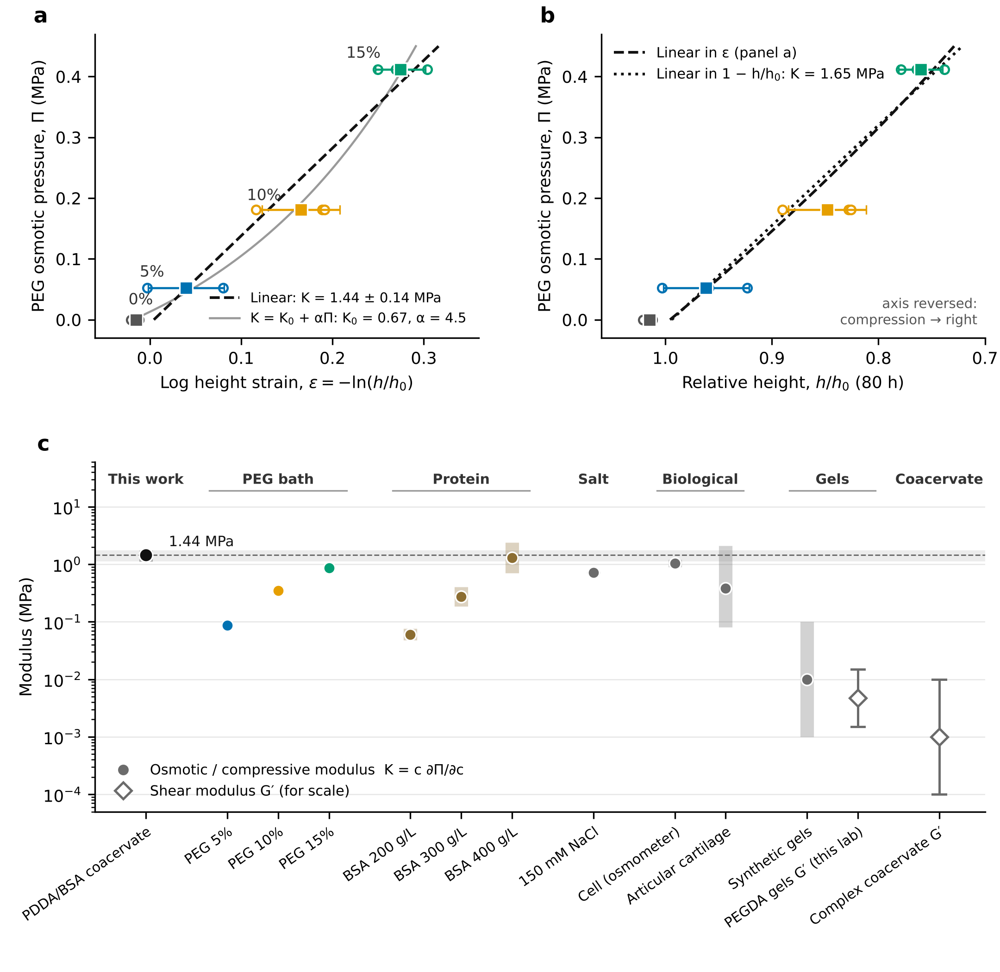

# PDDA/BSA coacervate under PEG osmotic stress: osmotic modulus

`analysis.py` holds the inputs, the fits, the figures and `results.md`. `build_pdf.py` assembles `coacervate_osmotic_modulus_report.pdf`: the figure, its legend, the focus and logic arc, these notes and the SI figure.
Re-run with `python3 analysis.py && python3 build_pdf.py`. To use your measured heights, replace `digitised_trajectories.csv`.

## Method

- The layer can only change height, so V/V0 = h/h0. At equilibrium the PEG pressure Π equals the coacervate's own osmotic pressure, so Π against strain is the coacervate equation of state.
- The osmotic modulus is K = c ∂Π/∂c = dΠ/dε, with ε = −ln(h/h0).
- Heights are the 80 h values of each sample (n = 3 per group, 0–15% PEG). They were digitised from the original per-sample panels. Where markers overlapped, the hidden value was solved from the plotted group mean.
- Strain is regressed on Π and the slope is inverted. Π is the variable you set; ε is the one that scatters. Regressing Π on ε biases K when ε is noisy.
- **20% PEG is not used.** The layer kept climbing the wall, so height no longer tracks volume. Sample 2 is also inconsistent (h/h0 = 0.88, less compressed than any 15% sample). All of the 20% data is shown in the SI figure.

## Results

| Model (0–15% PEG, n = 12) | K (MPa) | 95% CI |
|---|---|---|
| Linear in log strain (panel a) | **1.44 ± 0.14** | 1.13–1.76 |
| Linear in engineering strain 1 − h/h0 (panel b) | 1.65 ± 0.18 | 1.26–2.04 |
| Stiffening, K = K0 + αΠ | K0 = 0.67 ± 0.25, α = 4.5 ± 2.0 | K at 15% ≈ 2.5 |

The step moduli between group means are 0.95, 1.03 and 2.12 MPa. The stiffening model fits slightly better (ΔAICc = −1.8), but a difference under 2 is not decisive with n = 12.

## Is Π linear in ln(h/h0) over a wide range, and is that common?

**The range is narrower than it looks.** The 15% layer is at h/h0 = 0.76, which is a 1.3-fold increase in concentration. Over a window that small, almost any smooth equation of state looks linear. Write the modulus as K(ε) = K0·exp(βε), where β = d ln K/d ln c. The secant over the window then exceeds K0 by only (e^{βε} − 1)/βε. For a semidilute polymer in good solvent (Π ∝ c^{9/4}, β ≈ 2.3) the secant at ε = 0.29 is only about 40% above K0. With n = 3 and an SD of about 0.04 in ε, that much curvature is hard to see in a plot.

**Your data hints at the curvature.** The step modulus doubles between 10% and 15%. The stiffening fit gives α = 4.5, which means K at 15% is about 2.5 MPa.

**Over wide ranges, other forms are linear instead.** Osmotic stress data spanning decades are usually linear in log Π against log c (a power law: polymers, gels, proteins), or in log Π against spacing (exponential hydration forces between DNA or lipid layers). A plot linear in Π against ln c would mean a constant K, which is the small-strain limit, not a general law.

**Why the coacervate has a finite K0.** A coacervate in equilibrium with its dilute phase starts at Π = 0, not at some prestressed state. So K0 is finite and the response begins linear. Report K as the small-strain modulus over a stated window: 1.44 MPa for 0–0.41 MPa and ε ≤ 0.3.

## Which axis for the height?

Keep Π on the y-axis and strain on the x-axis. The slope is then the modulus, in the same orientation as a stress–strain curve. Do the fit the other way round (strain on Π), because Π is the controlled variable. Panel b shows the same data against plain h/h0, with the axis reversed so compression still runs to the right. At these strains the log and linear measures differ by at most 0.04 in strain. The engineering-strain modulus is 1.65 MPa against 1.44 MPa.

## How stiff is ~1.4 MPa? (panel c)

- **Osmotic moduli of crowded liquids:** the coacervate matches about 400 g/L BSA (hard-sphere estimate 0.7–2.4 MPa). It also matches the osmotic stiffness of a cell treated as an osmometer (Π/(1 − b) at 290 mOsm ≈ 0.9–1.2 MPa) and of 150 mM NaCl (K = Π ≈ 0.7 MPa). It is stiffer than the 15% PEG bath compressing it (0.87 MPa).
- **Confined-compression moduli:** it sits at the top of the range for articular cartilage (0.08–2.1 MPa, depth dependent; 0.38 MPa for full thickness).
- **Gels:** it is 1–3 orders of magnitude stiffer than the osmotic moduli of typical swollen synthetic gels (about 1–100 kPa) and the shear moduli of your PEGDA gels (1.5–15 kPa).
- **Coacervate shear:** complex coacervates are viscoelastic liquids with plateau G′ of roughly 10^{2}–10^{4} Pa. They flow in shear yet resist water removal at the MPa scale.

So the coacervate is not incompressible. Liquid water has a bulk modulus of 2.2 GPa, about 1500× higher. It is osmotically stiff in the sense of a very crowded protein or polyelectrolyte fluid.

## Caveats

- The PEG pressures are nominal. PEG entering the coacervate, or salt redistribution, would lower the effective Π and therefore K.
- The 15% layer rebounds by about 0.02 in h/h0 between 32 h and 80 h. Using the minimum height lowers its secant modulus by about 8%.
- The BSA values are a Carnahan–Starling estimate (M = 66.4 kDa, v_eff = 1.2–1.5 mL/g), not measured data. The synthetic-gel and coacervate-G′ bars are typical literature ranges and are meant for scale only. Cartilage values: Schinagl et al., J. Orthop. Res. 1997. Coacervate rheology: Spruijt et al., Macromolecules 2013.
- The heights are digitised from images. The reading error is about 0.005 in h/h0, and some hidden points were solved from the group means. Replace them with the measured values before publishing.
