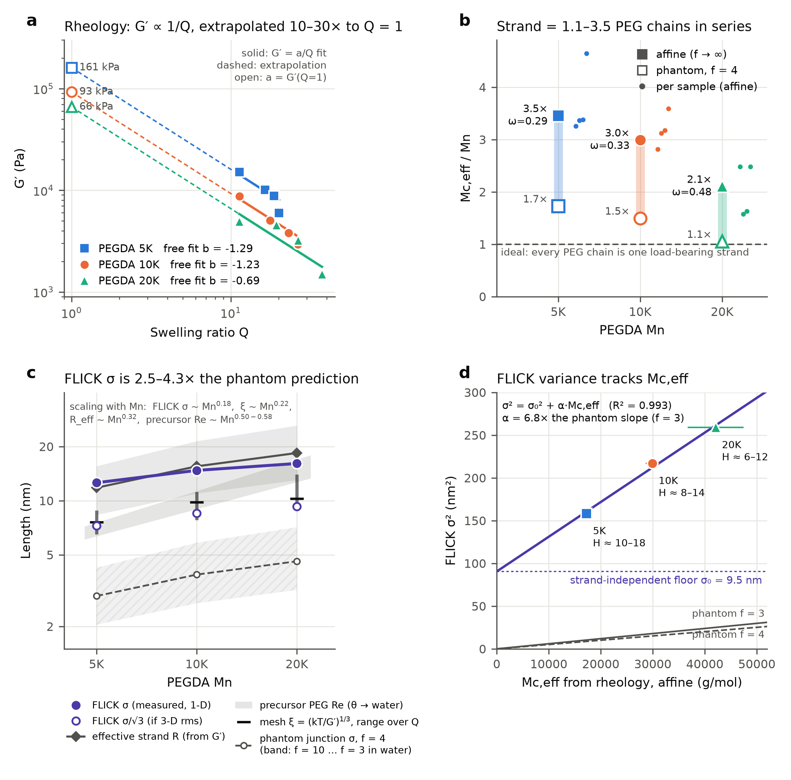

# PEGDA 5K / 10K / 20K: load-bearing strands from G′(Q), compared with FLICK

`analysis.py` holds every input, equation and number. `results.md` has the full tables, and `pegda_rheology_vs_flick.png` / `.pdf` is the figure.
Re-run with `python3 analysis.py` after changing the inputs at the top of the script.

## What rheology can and cannot tell you

A modulus counts **elastically effective (load-bearing) strands**, ν_e, times kT, times a model prefactor. It does not see loops, dangling PEG chains, sol, or how the junctions are arranged. Every "strand length" derived from G′ is therefore an **effective** number. This is the effective, conflated quantity you described.

| Quantity | Equation | What it needs |
|---|---|---|
| Effective strand density (swollen state) | ν_e = G′/kT | nothing (model-free up to the affine or phantom prefactor) |
| Rubber-elastic mesh size | ξ = (kT/G′)^{1/3} | nothing |
| Dry-state strand density | G′ = ν_e,dry RT φ λ², with φ = 1/Q and λ² = (φ₀/φ)^{2/3} | the preparation fraction φ₀ |
| Effective strand mass | M_c,eff = (1−2/f)·ρRT / (G′Q λ²) | f, φ₀ |
| Strand size | R₀ = (⟨R²⟩/M · M_c)^{1/2}, PEO θ: 0.805 Ų mol/g; water: R_g = 0.0215 M^0.583 nm | chain statistics |
| Phantom junction fluctuation | ⟨δr²⟩ = (f−1)/[f(f−2)] · R₀²; per axis σ² = ⟨δr²⟩/3 | f, R₀ |

Your G′ = a/Q fit (b = −1) is the λ = 1 case: each gel is taken as relaxed in the state where it was measured. I kept that convention so the numbers compare directly with your tables. If G′ was measured on equilibrium-swollen gels made at φ₀ > φ, every M_c,eff below rises by (φ₀Q)^{2/3}. For example, 20 wt% and Q = 15 gives a factor of about 1.9.

**Two corrections to the equations on your slide:**

1. **Drop Flory's (1 − 2M_c/M_n) factor.** It corrects for free ends when long primary chains are cross-linked at random (M_n ≫ M_c). In PEGDA the PEG chain *is* the strand (M_c ≈ M_n), so the factor goes to zero or negative.
2. **An affine network has no junction fluctuations.** The affine model pins junctions to the macroscopic deformation, so σ_affine = 0. The "σ(Affine)" column in your table is R_e/√6, which is the strand's radius of gyration, not a fluctuation. Only the phantom (or constrained-junction) model predicts a fluctuation.

## Results (ρ = 1.12 g cm⁻³, T = 298 K)

| | 5K | 10K | 20K |
|---|---|---|---|
| a = G′(Q=1) from the a/Q fit (Pa) | 160,600 ± 10,000 | 92,800 ± 4,100 | 66,000 ± 8,400 |
| R² of the fit; free exponent b | 0.88; −1.29 | 0.96; −1.23 | 0.63; −0.69 |
| M_c,eff affine (f → ∞) | 17.3k | 29.9k | 42.1k |
| M_c,eff phantom f = 4 | 8.6k | 15.0k | 21.0k |
| **M_c,eff / M_n** (affine to phantom) | **3.5 to 1.7** | **3.0 to 1.5** | **2.1 to 1.05** |
| Load-bearing fraction ω = M_n/M_c (affine) | 0.29 | 0.33 | 0.48 |
| Precursor R_e (θ / water), nm | 6.3 / 7.6 | 9.0 / 11.3 | 12.7 / 16.9 |
| Effective strand R₀ (θ, affine), nm | 11.8 | 15.5 | 18.4 |
| Mesh ξ = (kT/G′)^{1/3}, nm (range over the Q series) | 6.5–8.8 | 7.8–11.2 | 9.4–14.0 |
| Phantom junction σ per axis, f = 4 (θ / water), nm | 2.9 / 3.9 | 3.9 / 5.4 | 4.6 / 6.5 |
| Largest possible phantom σ (f = 3, water), nm | 4.2 | 5.8 | 7.1 |
| **FLICK σ, nm** | **12.6** | **14.7** | **16.1** |

The phantom σ uses the M_c that the same G′ implies for that f, so it depends on G′ and f only. Because of this, σ² = C·M_c,aff·(f−1)/(3f²) cannot exceed its f = 3 value for any f ≥ 3.

## The story

**1. The rheology is internally consistent but "sees" defective networks.**
G′ ∝ Q^{-1} to Q^{-1.3} holds within each molecular weight. Your fixed-b = −1/3 fits fail for a reason: each series changes the preparation concentration as well as the swelling, so it does not test how a single network swells.
The load-bearing strand works out to **1–3.5 PEG chains in series**, equivalently **only 30–50 % (affine) to 60–95 % (phantom) of PEG chains carry load**. 5K is the most defective, which fits the known picture: loops and dense poly(acrylate) clusters are most common at high acrylate density.
M_c,eff ∝ M_n^{0.64}, not M_n¹. The effective strand grows more slowly than the precursor chain.

**2. Length-scale ladder (panel c).** From smallest to largest:
- phantom junction fluctuation: 3–7 nm
- mesh ξ: 7–14 nm
- precursor R_e and effective-strand R: 6–26 nm
- FLICK σ: 12.6–16 nm

**FLICK is 2.5–4.3× larger than any phantom prediction the same G′ allows.** Even if σ is a 3-D rms rather than a per-axis value, it is still about 1.5–2.3× larger.

**3. FLICK still tracks the rheological strand (panel d).**
FLICK σ² is linear in M_c,eff (R² = 0.993, against 0.92 when plotted against M_n). The fit splits into two parts:
- σ² = σ₀² + α·M_c,eff
- **σ₀ ≈ 9.5 nm**: a floor that does not depend on the strand. Candidates are localization precision, drift, or motion of a whole cluster or heterogeneity region.
- The slope α is **6.8× the phantom slope** per axis, or 2.3× if σ is 3-D.

So FLICK and rheology agree on the *trend*. FLICK responds to the same effective strand that G′ counts, not to the precursor length. They disagree on the *magnitude*.

**4. Why the magnitude should disagree: stiffness average vs compliance average.**
- G′ is a **stiffness average**, ⟨k⟩, and is dominated by the percolating, well-connected backbone.
- A junction's thermal fluctuation is a **compliance average**, ⟨1/k⟩, and is dominated by weakly tethered junctions in soft, defect-rich regions.
- For any heterogeneous network, ⟨k⟩⟨1/k⟩ ≥ 1 (Jensen's inequality).

The ratio **H = (σ_FLICK / σ_phantom)² ≈ ⟨k⟩⟨1/k⟩** therefore works as a **heterogeneity index**:

| | 5K | 10K | 20K |
|---|---|---|---|
| H (water to θ strands) | 10–18 | 8–14 | 6–12 |

H falls as M_n rises. 5K PEGDA looks the most heterogeneous, which matches its lowest load-bearing fraction ω. Those two readouts are independent: one comes from G′ and one from FLICK.

**Caveat:** this trend in H comes from the σ₀ floor. If you subtract σ₀ first, H becomes nearly the same for all three molecular weights (about 8 for f = 4, set by α). Pinning down what σ₀ is (see check 2 below) therefore decides whether the heterogeneity trend is real.

**One-line take-home:**
- Rheology says the average load-bearing strand is 1–3.5 PEG chains.
- FLICK says junctions move as if they were held by strands roughly 3–9× longer (phantom model, f = 3–4), meaning most tracked junctions sit in softer-than-average surroundings.
- The gap between the two measures network heterogeneity. It appears to shrink from 5K to 20K, but that trend depends on what σ₀ is.

## Things to check in the input data

- **The 20K "G′(Q=1)" in your table is 64,091, but your own Origin fit says 65,091.** M_c for 20K is 42.0k, not 42.7k.
- **All three molecular weights have their first point at Q = 11.31**, identical to 0.01. That looks like a copy or paste error. Please verify it.
- **The 20K series is non-monotonic in G′·Q** (R² = 0.63). Its M_c,eff carries a ±13 % error, and its free exponent is −0.69.
- **A consistency test (the c*-theorem):** if G′ was measured at swelling equilibrium, then G′ ≈ Π_mix(Q) for *every* molecular weight, so all three series should fall on one G′(Q) curve. At Q = 11.3 they differ by 3×. This suggests G′ was measured in the as-prepared state, or that Q and G′ refer to different states. That decides whether λ = 1 (the convention used here) is right.
- **Precursor R_e:** your 4.52 / 6.40 / 9.05 nm set corresponds to ⟨R²⟩/M = 0.41 Ų mol/g, about half the standard PEO θ value of 0.805 (Rubinstein & Colby). Your 7.55 / 11.31 / 16.94 nm set is √6·R_g for PEG in water.
- **Keep one σ convention.** Your precursor σ is R_e/√3, which is a per-axis spread. Your "√6σ" column instead treats σ as R_g. The script treats FLICK σ as the per-axis rms displacement of a junction, and shows the 3-D-rms alternative alongside.

## What would make the numbers reliable rather than effective

1. **Record φ₀ (precursor wt%) for each sample and the state in which G′ was measured.** This fixes λ and removes the largest systematic error, up to about 2× on M_c.
2. **Measure the FLICK localization floor** on an immobilized reference, such as a dried or glassy gel or dye on glass. If it is about 9 nm, σ₀ is instrumental. If it is smaller, σ₀ is a real heterogeneity length.
3. **Measure the sol fraction and acrylate conversion** (by extraction and by NMR or FTIR). This separates "dangling or unreacted" chains from "loops", which gives a bound on ω that does not depend on the model.
4. **Look at the FLICK *distribution*** of σ across junctions, not just its mean. For a phantom network it should be narrow. A broad, long-tailed distribution directly confirms the stiffness-versus-compliance explanation.
