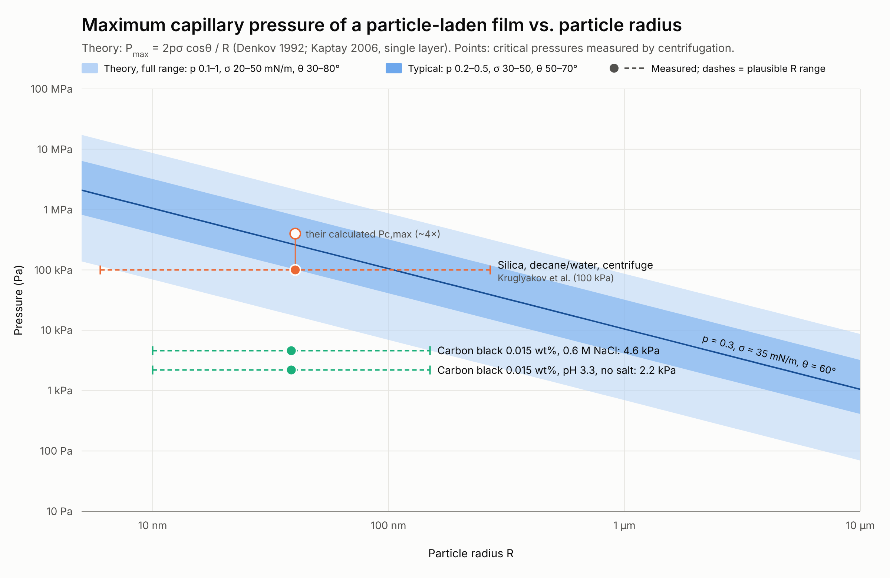

# Pickering emulsions: theoretical Pmax vs. measured critical pressures

`pmax_figure.py` holds every input and writes `pmax_vs_radius.svg`. `render.js` turns it into `pmax_vs_radius.png`.
Re-run with `python3 pmax_figure.py && NODE_PATH=$(npm root -g) node render.js`.

## Theory

Kaptay's general form of the Denkov et al. (1992) result is

  P_max = 2 p σ (cos θ + z) / R

Here R is the particle radius, σ the oil–water tension, θ the contact angle, p a packing prefactor, and z = 0 for a single (bridging) particle layer. Kaptay gives z = 0.633 for a close-packed double layer, in his sign convention, for θ > 90°.

| Parameter | Full band | Typical band | Centre line |
|---|---|---|---|
| p | 0.1–1 | 0.2–0.5 | 0.3 |
| σ (mN/m) | 20–50 | 30–50 | 35 |
| θ (°) | 30–80 | 50–70 | 60 |

The σ range covers triglyceride–water (~25) up to alkane–water (~50). The θ range is the window where particles stabilize O/W films. P_max goes to 0 as θ → 90° for a single layer, so 80° is a soft lower edge. I chose the **p range as an order-of-magnitude assumption**, not from a published table. I could not open Kaptay's paper to check his tabulated p values.

| R | full band | typical band | centre |
|---|---|---|---|
| 10 nm | 70 kPa – 8.7 MPa | 0.41–3.2 MPa | 1.05 MPa |
| 100 nm | 7 kPa – 0.87 MPa | 41–320 kPa | 105 kPa |
| 1 µm | 0.7–87 kPa | 4.1–32 kPa | 10.5 kPa |
| 5 µm | 0.14–17 kPa | 0.8–6.4 kPa | 2.1 kPa |

A close-packed bilayer (z = 0.633) raises the curve by about 2.3× at θ = 60°. Sparse or random packing lowers it (Morris, Neethling & Cilliers, *Langmuir* 27, 11475, 2011).

## Measured points and their caveats

| System | Measured | Source as found |
|---|---|---|
| Hydrophobized silica, n-decane/water, centrifuge | ~100 kPa, ≈25% of the authors' own calculated P_c,max (so ~400 kPa) | Kruglyakov, Nushtaeva & co-workers. Quoted in secondary literature, original value not seen. Related: *J. Colloid Interface Sci.* 276, 465 (2004); *Colloids Surf. A* (2005); Elsevier book chapter (2004) |
| Carbon black 0.015 wt%, 0.6 M NaCl, centrifuge | 4.6 kPa demulsification pressure | Quoted in secondary literature. **Original paper not confirmed** |
| Carbon black 0.015 wt%, pH 3.3, no salt, centrifuge | 2.2 kPa | as above |

- **The x positions of the measured points are not reported radii.** The dashed bars span a plausible size range. The silica bar runs from primary nanoparticles (Aerosil 12 nm, Ludox 15 nm diameter) to the 540 nm S-3 silica this group also used. The carbon black bar runs from primary particle to aggregate. The dot is the geometric mean.
- **The points are centrifuge onset pressures (osmotic pressure at the base of the cream), not film pressures.** Converting them needs the oil fraction and drop size, so read them as the same order of quantity, not the same quantity.
- Golemanov et al. (*Langmuir* 22, 4968, 2006) also report centrifuge stability tests on latex-stabilized emulsions, but I could not get their numbers, so they are not plotted.

## Sources

- Denkov, Ivanov, Kralchevsky, Wasan, *J. Colloid Interface Sci.* 150, 589 (1992), [doi:10.1016/0021-9797(92)90228-E](https://doi.org/10.1016/0021-9797(92)90228-E)
- Kaptay, *Colloids Surf. A* 282–283, 387 (2006), [ScienceDirect](https://www.sciencedirect.com/science/article/abs/pii/S0927775705009775)
- Kruglyakov, Nushtaeva, Vilkova, *J. Colloid Interface Sci.* 276, 465 (2004), [PubMed](https://pubmed.ncbi.nlm.nih.gov/15271575/)
- Kruglyakov & Nushtaeva, *Colloids Surf. A* (2005), thin emulsion layers on a porous plate, [ScienceDirect](https://www.sciencedirect.com/science/article/abs/pii/S0927775705002293)
- Kruglyakov & Nushtaeva, book chapter (2004), [ResearchGate](https://www.researchgate.net/publication/229393888_Chapter_16_Emulsions_stabilised_by_solid_particles_The_role_of_capillary_pressure_in_the_emulsion_films)
- Nushtaeva & Kruglyakov, *Mendeleev Commun.* 11, 235 (2001), [doi:10.1070/MC2001v011n06ABEH001505](https://doi.org/10.1070/MC2001v011n06ABEH001505)
- Morris, Neethling, Cilliers, *Langmuir* 27, 11475 (2011), random packing model
- Hatchell, Song, Daigle, *J. Colloid Interface Sci.* (2022), critical demulsification pressure, [ScienceDirect](https://www.sciencedirect.com/science/article/abs/pii/S0021979721018312)
